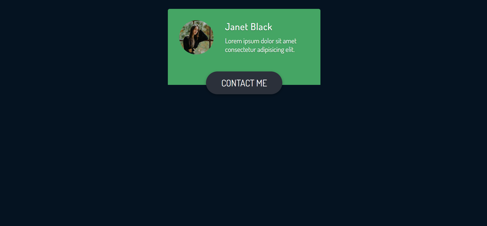
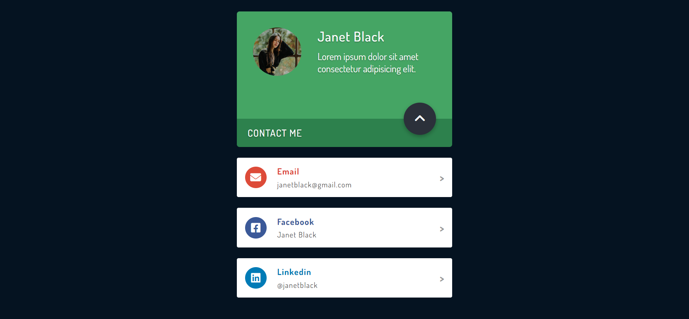

# profileCard

## Description
A user profile card that contains a brief introduction including user name, a user picture, and some text.  A contact button is displayed under the profile.  when the button is clicked the user social media links are displayed under the profile with an animation. The contact button changes shape, position and the text inside is changed to a ^ symbol.  The image below shows what the card looks like once the button has been clicked

## Demo
A demo for the project can be found at:  https://tod619.github.io/profileCard/